# 📦 us-stock-quant — 项目结构

> 共 **51** 个文件 | `.py` x23, `.tsx` x7, `.clj` x3, `.json` x3, `.md` x2, `.bat` x2, `.ts` x2, `(无后缀)` x1, `.frontend` x1, `.yaml` x1

```mermaid
graph TD
  us_stock_quant("[📦 us-stock-quant]")
  backend("[📁 backend]")
  us_stock_quant --> backend
  clj("[📁 clj]")
  us_stock_quant --> clj
  data("[📁 data]")
  us_stock_quant --> data
  frontend("[📁 frontend]")
  us_stock_quant --> frontend
  scripts("[📁 scripts]")
  us_stock_quant --> scripts
  backend_analyzers("[📁 analyzers]")
  backend --> backend_analyzers
  backend_backtest("[📁 backtest]")
  backend --> backend_backtest
  backend_crawlers("[📁 crawlers]")
  backend --> backend_crawlers
  backend_models("[📁 models]")
  backend --> backend_models
  backend_routers("[📁 routers]")
  backend --> backend_routers
  clj_src("[📁 src]")
  clj --> clj_src
  frontend_src("[📁 src]")
  frontend --> frontend_src
  clj_src_us_stock_quant("[📁 us_stock_quant]")
  clj_src --> clj_src_us_stock_quant
  frontend_src_api("[📁 api]")
  frontend_src --> frontend_src_api
  frontend_src_styles("[📁 styles]")
  frontend_src --> frontend_src_styles
  frontend_src_views("[📁 views]")
  frontend_src --> frontend_src_views
  Dockerfile[🐳 Dockerfile]
  us_stock_quant --> Dockerfile
  Dockerfile_frontend[📄 Dockerfile.frontend]
  us_stock_quant --> Dockerfile_frontend
  STRUCTURE_md[📝 STRUCTURE.md]
  us_stock_quant --> STRUCTURE_md
  config_yaml[⚙️ config.yaml]
  us_stock_quant --> config_yaml
  docker_compose_yml[🐳 docker-compose.yml]
  us_stock_quant --> docker_compose_yml
  nginx_conf[📄 nginx.conf]
  us_stock_quant --> nginx_conf
  project_plan_md[📝 project_plan.md]
  us_stock_quant --> project_plan_md
  requirements_txt[📄 requirements.txt]
  us_stock_quant --> requirements_txt
  backend___init___py[🐍 __init__.py]
  backend --> backend___init___py
  backend_config_py[🐍 config.py]
  backend --> backend_config_py
  backend_data_manager_py[🐍 data_manager.py]
  backend --> backend_data_manager_py
  backend_database_py[🐍 database.py]
  backend --> backend_database_py
  backend_main_py[🐍 main.py]
  backend --> backend_main_py
  backend_start_bat[🖥️ start.bat]
  backend --> backend_start_bat
  backend_analyzers___init___py[🐍 __init__.py]
  backend_analyzers --> backend_analyzers___init___py
  backend_analyzers_technical_py[🐍 technical.py]
  backend_analyzers --> backend_analyzers_technical_py
  backend_backtest___init___py[🐍 __init__.py]
  backend_backtest --> backend_backtest___init___py
  backend_backtest_engine_py[🐍 engine.py]
  backend_backtest --> backend_backtest_engine_py
  backend_backtest_indicators_py[🐍 indicators.py]
  backend_backtest --> backend_backtest_indicators_py
  backend_backtest_metrics_py[🐍 metrics.py]
  backend_backtest --> backend_backtest_metrics_py
  backend_backtest_strategies_py[🐍 strategies.py]
  backend_backtest --> backend_backtest_strategies_py
  backend_crawlers___init___py[🐍 __init__.py]
  backend_crawlers --> backend_crawlers___init___py
  backend_crawlers_data_cleaner_py[🐍 data_cleaner.py]
  backend_crawlers --> backend_crawlers_data_cleaner_py
  backend_crawlers_us_stock_source_py[🐍 us_stock_source.py]
  backend_crawlers --> backend_crawlers_us_stock_source_py
  backend_models___init___py[🐍 __init__.py]
  backend_models --> backend_models___init___py
  backend_models_backtest_py[🐍 backtest.py]
  backend_models --> backend_models_backtest_py
  backend_models_stock_py[🐍 stock.py]
  backend_models --> backend_models_stock_py
  backend_routers___init___py[🐍 __init__.py]
  backend_routers --> backend_routers___init___py
  backend_routers_backtest_py[🐍 backtest.py]
  backend_routers --> backend_routers_backtest_py
  backend_routers_data_sync_py[🐍 data_sync.py]
  backend_routers --> backend_routers_data_sync_py
  backend_routers_stocks_py[🐍 stocks.py]
  backend_routers --> backend_routers_stocks_py
  clj_project_clj[📄 project.clj]
  clj --> clj_project_clj
  clj_src_us_stock_quant_core_clj[📄 core.clj]
  clj_src_us_stock_quant --> clj_src_us_stock_quant_core_clj
  clj_src_us_stock_quant_strategies_clj[📄 strategies.clj]
  clj_src_us_stock_quant --> clj_src_us_stock_quant_strategies_clj
  data_us_stocks_db[📄 us_stocks.db]
  data --> data_us_stocks_db
  frontend_index_html[🌐 index.html]
  frontend --> frontend_index_html
  frontend_package_json[📋 package.json]
  frontend --> frontend_package_json
  frontend_start_bat[🖥️ start.bat]
  frontend --> frontend_start_bat
  frontend_tsconfig_json[📋 tsconfig.json]
  frontend --> frontend_tsconfig_json
  frontend_tsconfig_node_json[📋 tsconfig.node.json]
  frontend --> frontend_tsconfig_node_json
  frontend_vite_config_ts[🟦 vite.config.ts]
  frontend --> frontend_vite_config_ts
  frontend_src_App_tsx[⚛️ App.tsx]
  frontend_src --> frontend_src_App_tsx
  frontend_src_main_tsx[⚛️ main.tsx]
  frontend_src --> frontend_src_main_tsx
  frontend_src_api_index_ts[🟦 index.ts]
  frontend_src_api --> frontend_src_api_index_ts
  frontend_src_styles_index_scss[🎨 index.scss]
  frontend_src_styles --> frontend_src_styles_index_scss
  frontend_src_views_AnalysisView_tsx[⚛️ AnalysisView.tsx]
  frontend_src_views --> frontend_src_views_AnalysisView_tsx
  frontend_src_views_BacktestView_tsx[⚛️ BacktestView.tsx]
  frontend_src_views --> frontend_src_views_BacktestView_tsx
  frontend_src_views_Dashboard_tsx[⚛️ Dashboard.tsx]
  frontend_src_views --> frontend_src_views_Dashboard_tsx
  frontend_src_views_StockList_tsx[⚛️ StockList.tsx]
  frontend_src_views --> frontend_src_views_StockList_tsx
  frontend_src_views_StrategyView_tsx[⚛️ StrategyView.tsx]
  frontend_src_views --> frontend_src_views_StrategyView_tsx
  scripts_project_tree_py[🐍 project_tree.py]
  scripts --> scripts_project_tree_py
```

---

### 📊 文件类型统计

| 类型 | 数量 |
|------|------|
| 🐍 `.py` | 23 |
| ⚛️ `.tsx` | 7 |
| 📄 `.clj` | 3 |
| 📋 `.json` | 3 |
| 📝 `.md` | 2 |
| 🖥️ `.bat` | 2 |
| 🟦 `.ts` | 2 |
| 📄 `(无后缀)` | 1 |
| 📄 `.frontend` | 1 |
| ⚙️ `.yaml` | 1 |
| 🐳 `.yml` | 1 |
| 📄 `.conf` | 1 |
| 📄 `.txt` | 1 |
| 📄 `.db` | 1 |
| 🌐 `.html` | 1 |

---
_由 [project_tree.py](scripts/project_tree.py) 自动生成_
